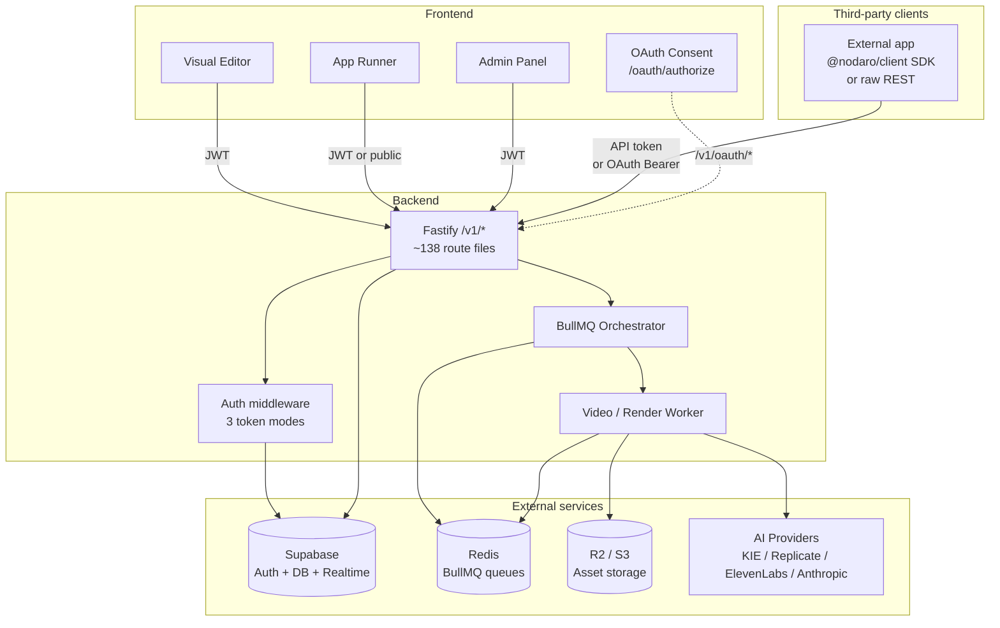

# Architecture

This is a contributor-and-curious-developer overview of how Nodaro is
put together. It covers the layers, the request lifecycle, how
workflows execute, how authentication works across three different
token formats, edition gating, and why some of the design choices
were made.

## 1. One-paragraph summary

Nodaro is a REST-first AI workflow engine. A Vite + React Flow editor
lets users wire AI **nodes** (image generation, video composition,
LLM, audio) into a DAG. Workflows are persisted in Supabase Postgres;
when run, a Fastify backend takes the DAG, topologically sorts it, and
hands node-level work to BullMQ workers (or, for sync routes, runs it
inline). External AI providers (KIE.ai, Replicate, Anthropic,
ElevenLabs) do the heavy lifting; outputs land in S3-compatible
storage. The same backend serves three tiers — Community (self-hosted,
no billing), Business (admin panel), Cloud (full SaaS with credits and
Stripe) — and three authentication modes (Supabase JWT, API token,
OAuth-app token).

## 2. System diagram



## 3. Layers

### Frontend

Vite + React 19 + React Router 7 SPA, served as static files by
Caddy. Two top-level products live in the same bundle:

- **The visual editor** (`frontend/src/components/editor/`) — React
  Flow canvas, ~100 custom node components, config panels per node
  category, an in-browser DAG executor for live runs.
- **The app runner** (`frontend/src/components/presentation/`) — a
  consumer-facing surface that renders a published workflow as a
  guided form (inputs → outputs).
- **The admin panel** (`frontend/src/app/(admin)/`) — Business and
  Cloud only. Pricing config, user management, jobs, models, alerts,
  credit audit, KIE.ai balance, etc.
- **The OAuth consent screen** (`frontend/src/app/(auth)/oauth/`) —
  rendered when third-party apps redirect users into
  `/oauth/authorize`.

Server state via React Query, local UI state via Zustand, canvas state
via React Flow's own store.

### Backend

Fastify (Node.js 22, TypeScript). ~138 route files under
`backend/src/routes/` registered via `app.register()` in `app.ts` —
each file may export multiple HTTP endpoints. Auth is a single global
`preHandler` hook in `middleware/auth.ts`. Each route declares its
own Zod schemas for request/response validation.

Three sibling Node processes ship as part of the backend image:

| Process | Entrypoint | Role |
|---|---|---|
| API server | `server.ts` → `app.ts` | Fastify HTTP server. |
| Video worker | `worker.ts` | Pulls per-node BullMQ jobs, calls AI providers, uploads outputs to R2. |
| Render worker | `render-worker.ts` | Remotion renderer. CPU-heavy; runs headless Chrome. |
| Orchestrator | `orchestrator.ts` → `workers/orchestrator-worker.ts` | Workflow-level DAG execution. |

In Docker, all four launch from a single `start.sh` and Caddy fronts
the API server. In a scaled deployment, each can run in its own
container — they coordinate only through Redis (BullMQ queues) and
Postgres (`workflow_executions.node_states`).

### Workers

- **Video worker** (`backend/src/worker.ts`) handles 40+ "single-node"
  job types: image generation, video generation (image-to-video / text-to-video), FFmpeg processing,
  audio nodes, etc. Concurrency `VIDEO_WORKER_CONCURRENCY` (default
  50) — these are I/O-bound on external API calls.
- **Render worker** (`backend/src/render-worker.ts`) handles Remotion
  composition rendering for the scene-graph, after-effects,
  motion-graphics, lottie-overlay, 3d-title, and composite node types.
  Concurrency `RENDER_WORKER_CONCURRENCY` (default 2) — CPU-bound,
  spawns headless Chrome.
- **Orchestrator** (`backend/src/workers/orchestrator-worker.ts`)
  reads `workflow_executions` rows, sorts the DAG, runs it
  level-by-level. Concurrency `ORCHESTRATOR_CONCURRENCY` (default 20).

### Services

Cross-cutting logic that doesn't belong in a route:

- `services/workflow-engine/` — DAG execution. 8 files: type
  definitions, topological sort, input resolution, output extraction,
  payload building, the node executor, an inline executor for nodes
  that don't queue, and a sub-workflow handler.
- `services/social/` — OAuth + publishing for Instagram, TikTok,
  YouTube, LinkedIn, X, Facebook. Includes AES-256-GCM token
  encryption and per-platform adapters.

### Shared package

`packages/shared/` (published as `@nodaro/shared` on npm) contains
pure-logic code shared by frontend and backend:

- Type definitions for nodes, edges, presentation items.
- AI model registries and prompt templates.
- Credit identifier resolvers.
- Ancestor-ref + flatten helpers.
- LLM model selection logic.

The frontend imports it via Vite alias; the backend uses relative
imports (`tsc` doesn't rewrite path aliases). Deduplicating ~500 lines
that used to live in two places.

### Client SDK

`packages/client/` (published as `@nodaro/client` on npm) is a typed
REST wrapper around the public API. Three auth strategies
(`StaticTokenAuth`, `CallbackAuth`, `supabaseAuth`), 17 resource
classes (`workflows`, `projects`, `jobs`, `executions`, `nodes`,
`developerApps`, `oauth`, `apps`, `characters`, `locations`, `objects`,
`pipelines`, `reduce`, `promptHelper`, `voices`, `credits`, `uploads`).
The frontend dogfoods the SDK for its execution endpoints. See
[SDK Reference](./sdk-reference.md).

## 4. Data model overview

Schema lives in `supabase/migrations/`, applied in filename order.
Highlights:

| Table | Role |
|---|---|
| `profiles` | Extends `auth.users`. Holds tier, credits, role, preferences. |
| `projects` | Top-level container for workflows. |
| `workflows` | DAG definition (`nodes`, `edges` JSONB) + `settings`. |
| `workflow_executions` | One row per server-orchestrated run; tracks `node_states` JSONB, progress counts, total credits used. |
| `workflow_triggers` | Webhook + schedule triggers attached to workflows. |
| `jobs` | Per-node execution records (single-node + workflow-spawned). |
| `assets` | Generated files in R2 (image/video/audio), keyed by `r2_key`. |
| `model_pricing` | Credit cost per model identifier; admin-configurable. |
| `credit_transactions` | Audit log for grants, charges, refunds. |
| `developer_apps` | OAuth client registry (Phase 2). |
| `developer_app_authorizations` | Per-(user, app) consent grant; carries scopes. |
| `developer_app_tokens` | Issued OAuth access tokens (`ndr_app_…`). |
| `api_tokens` | Personal API tokens (`ndr_…`). |
| `social_connections` | Encrypted OAuth tokens for Instagram/TikTok/YouTube/etc. |

RLS policies are enforced on every table. Service-role-only operations
go through `SECURITY DEFINER` Postgres functions to avoid the policy
recursion footgun on `profiles`.

## 5. Workflow execution

When a user clicks **Run** in the editor, the frontend has two paths:

1. **Frontend DAG executor** — runs the DAG in the browser, calling
   per-node REST endpoints directly. Used in interactive editing —
   you can see results node-by-node as they finish.
2. **Backend orchestrator** — used for triggered runs (webhook,
   schedule, API), the app runner, and explicit "Run on server"
   actions. Persists progress in `workflow_executions.node_states` so
   any client can poll.

The orchestrator does:

1. Load `workflows.nodes` and `workflows.edges`.
2. Topologically sort the DAG into levels (one level = nodes with no
   uncompleted dependencies).
3. For each level, run all nodes in parallel up to `tier_parallelism`
   (per-user) ∧ `MAX_CONCURRENT_NODES_PER_EXECUTION` (server ceiling).
4. Each node falls into one of three execution categories:

| Category | Where | Example node types | Why |
|---|---|---|---|
| **Worker-queued** | BullMQ → video/render worker | `generate-image`, `generate-video` (dispatches to the `image-to-video` / `text-to-video` worker handlers), `text-to-speech`, `combine-videos`, `render-video`, … (40+) | Long-running or external API calls. Decoupled from the orchestrator process for backpressure. |
| **Sync HTTP** | Internal `fetch` to backend route | `llm-chat` (Generate Text — routes via `/v1/llm-chat`; the legacy `/v1/ai-writer` route remains for back-compat), `after-effects-ai`, `motion-graphics-ai`, `prompt-helper`, social-publish nodes (~15) | Cheap, sub-second LLM calls. No queueing overhead. |
| **Inline** | Run inside the orchestrator process | `combine-text`, `split-text`, `composite` | Pure JS, no external I/O, no need to queue. |

5. After each node finishes, propagate its output to downstream
   nodes' input resolvers and update the `node_states` JSONB blob in
   one DB write per node.
6. Two stop modes:
   - **`cancelled`** — abort immediately, in-flight nodes are
     orphaned (no rollback of credit charges that already happened).
   - **`stopping`** — drain the current level then stop without
     starting the next.

Per-node timeout is 30 minutes; per-workflow is 60 minutes. Sub-workflows
(referenced via the `sub-workflow` node type) execute recursively with
a depth limit of 5 and cycle detection.

## 6. Auth model — three modes

Nodaro accepts three different bearer-token formats. The auth
middleware (`backend/src/middleware/auth.ts`) decides what kind of
token it's looking at by prefix:

| Token shape | Source | Sets `userId` | Sets `appAuthorization` |
|---|---|---|---|
| `eyJ…` (JWT) | Supabase Auth user session | yes | undefined |
| `ndr_app_<64hex>` | OAuth access token from a developer app | yes (the user who authorized the app) | yes — `{ appId, authorizationId, scopes }` |
| `ndr_<64hex>` | Personal API token | yes (the token's owner) | undefined |
| `X-Internal-Orchestrator-Secret` header | Internal orchestrator → API call | from request body | undefined |

Resolution order in `registerAuthHook`:

1. Public-route whitelist — skip auth entirely (e.g. `/v1/openapi.json`,
   `/v1/webhooks/:token`, `/v1/api/*`).
2. Internal-orchestrator-secret header — verified with constant-time
   equality.
3. `ndr_app_…` token — looked up in `developer_app_tokens`, joined to
   `developer_app_authorizations`, checked for revocation/expiry.
4. JWT — verified via `supabase.auth.getUser()`, role read from
   `profiles`, cached for 5 minutes.
5. Anything else → 401.

Personal API tokens (`ndr_…`) authenticate **inside**
`apiTokenRoutes` — those routes are public-route-whitelisted and
register their own scoped `preHandler` that validates the token,
checks rate limits, and applies workflow scoping. Same shape, just
not in the global hook.

## 7. Edition gating

Three editions live in the same codebase:

- **Community** (`EDITION=community`, default) — self-hostable.
  No admin panel. No credit ledger. No Stripe. Anyone who signs up
  becomes a regular user.
- **Business** (`EDITION=business`) — adds the admin panel + user
  management UI. Still self-hosted, still no billing.
- **Cloud** (`EDITION=cloud`) — adds the credit system, Stripe
  webhooks, AI-cost markup. Powers `nodaro.ai`. Not intended for
  self-hosting.

Helpers in `backend/src/lib/config.ts`:

```ts
isCommunity() // EDITION === "community"
isBusiness()  // EDITION === "business"
isCloud()     // EDITION === "cloud"
hasAdmin()    // business || cloud
hasCredits()  // cloud only
```

Frontend mirrors are in `frontend/src/lib/edition.ts`, reading
`VITE_EDITION` (Vite inlines it at build time).

**Convention:** never compare `config.EDITION === "…"` directly — use
the helpers. Credit-related code gates on `hasCredits()`. Admin-only
routes gate on `hasAdmin()`. Both helpers are checked at the top of
the route handler before any business logic runs.

## 8. Why these choices

A few of the more opinionated decisions:

- **Fastify over Express.** First-class TypeScript types,
  schema-driven validation hooks, the plugin model encourages
  encapsulation. Routes register via `app.register(plugin)`, each
  plugin is its own scope. Performance is a fringe benefit.
- **BullMQ over alternatives.** Mature Redis-backed queue, a great
  dashboard (`bullboard`), retry/backoff/concurrency primitives match
  what we need. Pure Node stack — no Python/Celery.
- **REST over GraphQL.** Easier OAuth scoping at the route level,
  trivial OpenAPI generation, simpler for third-party clients to
  reason about. The cost (overfetching) is small for an automation
  API where each request is purposeful.
- **Supabase over rolling our own.** Postgres + Auth + Realtime + RLS
  in one managed service. RLS in particular saves piles of bespoke
  authorization code — the database itself enforces "users can only
  see their own rows."
- **React Flow for the editor.** Best-in-class headless DAG canvas.
  We extend it heavily; rolling our own would have been months of
  yak-shaving.
- **Remotion for video composition.** Declarative React → MP4. The
  same composition that previews in `@remotion/player` in the editor
  renders identically on the server. Removes the entire class of
  "preview doesn't match output" bugs.
- **AI-provider abstraction over direct vendor SDKs.** Routing every
  LLM through `lib/llm-client.ts` (with KIE.ai + Anthropic
  fallback) means we can swap providers per model without touching
  feature code. Same shape for image/video providers — `providers/`
  has pluggable clients per vendor.
- **Polling, not realtime, for execution status.** Simpler to deploy.
  No WebSocket/SSE infrastructure to scale. Workflow status changes
  at second-scale, not millisecond-scale; polling every 2–5s is
  cheap.

## See also

- [API Integration](./api-integration.md) — calling the API from your
  own server
- [OAuth Flow](./oauth-flow.md) — third-party app authorization
- [SDK Quickstart](./sdk-quickstart.md) — TypeScript client
- [Deployment](./deployment.md) — self-hosting
- [Edge modes](./edge-modes.md) — request flow specifics
***REDACTED-OSS-SCRUB***
