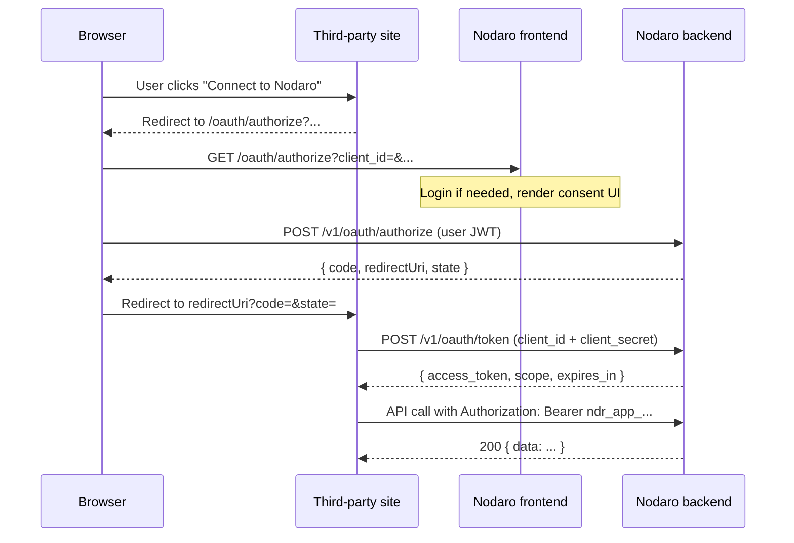

# OAuth 2.0 Flow

This guide walks through the full Nodaro OAuth 2.0 authorization-code flow:
when to use it, how to register an app, the seven steps from "Connect to
Nodaro" button to authenticated API call, scope semantics, common errors,
and where Nodaro deviates from RFC 6749.

If you only need to call the API as yourself (one Nodaro account, one
backend), OAuth is overkill — use a personal API token instead. See
[When you need OAuth](#1-when-you-need-oauth).

## 1. When you need OAuth

There are two ways to authenticate against the Nodaro API:

| Use case | Auth method | Token format |
|----------|-------------|--------------|
| Server-to-server **for your own account** | Personal API token | `ndr_<...>` |
| Third-party app acting on **other users'** accounts | OAuth 2.0 access token | `ndr_app_<...>` |

**Use a personal API token when:**
- You're scripting your own Nodaro account from a server cron, CI job, or
  internal tool.
- Only your own Nodaro user ever needs to authenticate.
- You don't need a consent screen or per-user revocation.

Personal API tokens are minted from `/settings/api-tokens` and live
indefinitely until revoked. See [API Integration](./api-integration.md)
for details.

**Use OAuth when:**
- You're building a hosted product (web app, SaaS, marketplace) and your
  end users have their own Nodaro accounts.
- You need users to grant your app a scoped subset of their account's
  capabilities.
- You want users to be able to revoke your app at any time without
  affecting other apps.

The rest of this doc covers OAuth.

## 2. Big picture: the 7-step flow

Nodaro implements the standard OAuth 2.0 authorization-code grant
(RFC 6749 §4.1) with a few modern simplifications (see
[§13](#13-differences-from-rfc-6749)).



The seven steps in plain English:

1. **User clicks "Connect to Nodaro"** on the third-party site.
2. **Third-party site redirects** the browser to Nodaro's
   `/oauth/authorize` page with `client_id`, `redirect_uri`, `scope`,
   and `state` in the query string.
3. **Nodaro renders the consent screen** (after a login if needed),
   showing the app's name, logo, and the requested scopes.
4. **User clicks Allow.** The frontend POSTs to `/v1/oauth/authorize`
   (authenticated as the user) and receives a one-shot authorization
   `code`.
5. **Browser is redirected** back to the third-party site's
   `redirect_uri` with `?code=...&state=...`.
6. **Third-party server exchanges the code** for an access token at
   `/v1/oauth/token`, authenticating with `client_id` + `client_secret`.
7. **Third-party server uses the token** to call the Nodaro REST API on
   the user's behalf, sending `Authorization: Bearer ndr_app_<...>`.

## 3. Step 1: Register your app

Open `/settings/developer-apps` on the Nodaro instance you're targeting
(e.g. `https://nodaro.example.com/settings/developer-apps`) and click
**New developer app**.

Fill in the form:

| Field | Required | Constraints |
|-------|----------|-------------|
| **Name** | yes | 1-100 chars. Shown to users on the consent screen. |
| **Description** | no | ≤500 chars. Shown under the name on the consent screen. |
| **Homepage URL** | no | `https://...` only (`http://localhost` allowed for dev). |
| **Logo URL** | no | Same scheme rules as homepage. Square images render best. |
| **Redirect URIs** | yes | 1-10 entries. Exact-match URIs your server will receive the code at. **Wildcards are NOT supported.** |
| **Allowed origins** | no | 0-5 bare origins (no path, no query, no hash) for CORS. Required only if your frontend ever calls Nodaro from a browser. |
| **Scopes requested** | yes | At least 1 scope. Superset of what your app might ever request — users can grant a subset, but you cannot exceed this list at authorize-time. |

On save, a modal shows your `clientId` (format `app_<32hex>`) **and**
`clientSecret` (format `sec_<64hex>`).

> **`clientSecret` is shown EXACTLY ONCE.** Copy it into your secret
> manager before dismissing the modal — Nodaro stores only a bcrypt
> hash and cannot recover the plaintext.

If you lose the secret (or want to rotate it as a security hygiene
measure), use the **Rotate secret** button on the app's detail page —
this calls `POST /v1/developer-apps/:id/rotate-secret` and returns a
new secret. **The old secret is invalidated immediately**, so any
running services need their config updated before existing tokens
expire (or refresh, if you mint new ones).

You can register up to **5 apps per user**.

## 4. Scope vocabulary

There are 11 scopes total. The canonical list lives in
[`backend/src/lib/scopes.ts`](https://github.com/nodaroai/app.nodaro.ai/blob/main/backend/src/lib/scopes.ts).

| Scope | What it grants | Routes gated today |
|-------|----------------|--------------------|
| `workflows:read` | Read the user's workflows | `GET /v1/projects/:projectId/workflows` |
| `workflows:write` | Create and modify workflows | (reserved — no routes gated yet) |
| `workflows:execute` | Run workflows on the user's behalf | `POST /v1/workflows/:id/run`; the prompt-wizard MCP tools |
| `jobs:read` | Read job status and results | `GET /v1/jobs/:id` |
| `assets:read` | Read the user's uploaded assets | (reserved) |
| `assets:write` | Upload assets to the user's account | (reserved) |
| `credits:read` | See the user's credit balance | (reserved) |
| `apps:read` | Read published apps | (reserved) |
| `pipelines:read` | Read the user's Story-to-Video pipelines | `GET /v1/pipelines/*` |
| `pipelines:execute` | Run / branch pipeline stages | `POST /v1/pipelines/:id/branch` and run routes |
| `pipelines:approve` | Approve pipeline stage output | pipeline approval routes |

> **Honest disclosure:** the gated scopes today are `workflows:read`,
> `workflows:execute`, `jobs:read`, and the three `pipelines:*` scopes.
> The other five (`workflows:write`, `assets:read`, `assets:write`,
> `credits:read`, `apps:read`) are reserved names that future routes will
> gate. Request scopes only if you actually intend to use them — minimal
> scope sets earn user trust.

The exact scope description shown to the user on the consent screen is
defined in [`frontend/src/app/oauth/authorize/page.tsx`](https://github.com/nodaroai/app.nodaro.ai/blob/main/frontend/src/app/oauth/authorize/page.tsx).

## 5. Step 2: Build the redirect URL

When the user clicks "Connect to Nodaro", redirect their browser to:

```text
https://nodaro.example.com/oauth/authorize?
  client_id=app_<32hex>&
  redirect_uri=https://yourapp.com/oauth/callback&
  response_type=code&
  scope=workflows:read+workflows:execute&
  state=<random_csrf_token>
```

Required query parameters:

- **`client_id`** — your app's clientId from the registration modal.
- **`redirect_uri`** — must EXACTLY match one of your registered
  redirect URIs (byte-for-byte). The backend rejects mismatches with
  HTTP 400 `invalid_redirect_uri`.
- **`response_type=code`** — only `code` is supported. Other values
  cause the frontend to refuse to render the consent screen.
- **`scope`** — space-separated (or `+`-separated; both are accepted)
  list of scope strings. Must be a subset of the app's
  `scopes_requested`.
- **`state`** — opaque CSRF token, generated per-authorization on your
  server and stored in a session cookie. The backend echoes `state`
  unchanged on the redirect back. **Always verify it matches** before
  exchanging the code.

Generating `state` server-side:

```typescript
import { randomBytes } from "node:crypto"

// In your /connect handler:
const state = randomBytes(32).toString("hex")
req.session.oauthState = state

const url = new URL("https://nodaro.example.com/oauth/authorize")
url.searchParams.set("client_id", process.env.NODARO_CLIENT_ID!)
url.searchParams.set("redirect_uri", "https://yourapp.com/oauth/callback")
url.searchParams.set("response_type", "code")
url.searchParams.set("scope", "workflows:read workflows:execute")
url.searchParams.set("state", state)
res.redirect(url.toString())
```

If the user cancels (clicks "Cancel" on the consent screen), Nodaro
redirects to `redirect_uri?error=access_denied&error_description=User+cancelled&state=<your_state>`
— treat this as a non-error UX outcome, not a server fault.

## 6. Step 3: Exchange code for token

After the user clicks **Allow**, Nodaro redirects the browser to:

```text
https://yourapp.com/oauth/callback?code=ndr_code_<48hex>&state=<your_state>
```

The code format is `ndr_code_` followed by 48 hex chars.

**Step 1 in your callback handler: verify `state`.** If it doesn't
match the value you stored when generating the redirect URL, abort the
flow — this is the OAuth defense against CSRF.

**Step 2: exchange the code on your server.** Never put this call in
the browser — `client_secret` would leak to anyone with devtools.

### Using the SDK

```typescript
import { createClient, StaticTokenAuth } from "@nodaro/client"

// The token endpoint is public (auth is via client_id + client_secret in
// the body), so we pass an empty token here.
const client = createClient({
  baseUrl: "https://nodaro.example.com",
  auth: new StaticTokenAuth(""),
})

const tokens = await client.oauth.exchangeCode({
  client_id: process.env.NODARO_CLIENT_ID!,
  client_secret: process.env.NODARO_CLIENT_SECRET!,
  code: req.query.code as string,
  redirect_uri: "https://yourapp.com/oauth/callback",
})

// tokens.access_token  — "ndr_app_<64hex>"
// tokens.scope         — space-separated granted scopes (subset of requested)
// tokens.expires_in    — 7776000 (seconds = 90 days)
// tokens.token_type    — "Bearer"
```

### Using curl

```bash
curl -X POST https://nodaro.example.com/v1/oauth/token \
  -H "Content-Type: application/json" \
  -d '{
    "grant_type": "authorization_code",
    "client_id": "app_...",
    "client_secret": "sec_...",
    "code": "ndr_code_...",
    "redirect_uri": "https://yourapp.com/oauth/callback"
  }'
```

Response (snake_case per RFC 6749):

```json
{
  "access_token": "ndr_app_<64hex>",
  "token_type": "Bearer",
  "scope": "workflows:read workflows:execute",
  "expires_in": 7776000
}
```

> **Codes are one-shot.** RFC 6749 mandates a code can be redeemed at
> most once. A second attempt returns HTTP 400 `invalid_grant`.
> Codes also expire 10 minutes after issue — design your callback
> handler to redeem immediately, not lazily.

## 7. Step 4: Use the token

Configure a per-user client with the access token:

```typescript
import { createClient, StaticTokenAuth } from "@nodaro/client"

const userClient = createClient({
  baseUrl: "https://nodaro.example.com",
  auth: new StaticTokenAuth(tokens.access_token),
})

// Now every call acts as the authorizing user, scoped to what they granted:
const projects = await userClient.projects.list()
const workflows = await userClient.workflows.list(projects.data[0].id)
const job = await userClient.workflows.run(workflows.data[0].id)
```

Tokens live **90 days** (`expires_in: 7776000` seconds). After expiry,
calls return HTTP 401 — at which point you re-prompt the user with a
fresh `/oauth/authorize` redirect.

There are no refresh tokens in the MVP. This is a deliberate tradeoff
(see [§13](#13-differences-from-rfc-6749)).

## 8. Storing tokens

A few rules:

- **Server-side only.** Never put `access_token` in browser
  localStorage, sessionStorage, or in a cookie that JavaScript can read
  (`HttpOnly` is fine if you're using the cookie purely for your own
  app's session, not for forwarding to Nodaro).
- **Encrypt at rest** if your platform supports it. Nodaro stores a
  SHA-256 hash of the token, not the plaintext, so a database leak on
  your side is the only way the bearer token can escape.
- **One token per (user, app, latest consent).** If a user re-consents
  for the same app, the authorization row is upserted (per-user-per-app
  uniqueness on `developer_app_authorizations`) and a new token is
  minted. Old tokens remain valid until they expire or are revoked, so
  track which tokens are in active use to avoid leaks.
- **Don't share tokens between users.** Each token authenticates a
  specific Nodaro user; using one user's token in another user's
  context is an authorization bug.

## 9. Revocation

Per RFC 7009, the revoke endpoint always returns HTTP 200 — even for
unknown tokens. This prevents an attacker from probing token validity.

```typescript
await client.oauth.revoke(tokens.access_token)
// → { success: true }
```

Or via curl:

```bash
curl -X POST https://nodaro.example.com/v1/oauth/revoke \
  -H "Content-Type: application/json" \
  -d '{ "token": "ndr_app_..." }'
```

Server-side, this sets `revoked_at` on the token row. Subsequent API
calls with the revoked token return HTTP 401.

**Users can also revoke from the Nodaro UI** at
`/settings/developer-apps` (the "Authorized apps" section lists every
app they've granted access to and offers a per-app revoke button).
Treat 401 errors as "the user revoked" → re-prompt for consent.

When to call `revoke()` from your code:

- User logs out of your app (revoke their Nodaro token along with
  their session).
- User deletes their account on your platform.
- User hits "Disconnect Nodaro" in your app's settings.

## 10. Common errors

OAuth-specific errors returned by the token endpoint:

| HTTP status | Body | When | What to do |
|-------------|------|------|------------|
| 400 | `{ "error": "invalid_request", "error_description": "..." }` | Malformed body, missing field | Fix request shape |
| 401 | `{ "error": "invalid_client", "error_description": "Unknown client" }` | `client_id` doesn't match any registered app | Check `client_id` env var |
| 401 | `{ "error": "invalid_client", "error_description": "Bad client_secret" }` | `client_secret` wrong (often: rotated and old one cached) | Pull the latest secret; restart your service |
| 400 | `{ "error": "invalid_grant", "error_description": "Code expired, used, or redirect_uri mismatch" }` | Code >10 min old, redeemed twice, or `redirect_uri` doesn't match the one used at authorize | Re-prompt user; ensure URIs are byte-for-byte identical |

Authorize-endpoint errors (returned to the frontend, NOT redirected):

| HTTP status | Body | When | What to do |
|-------------|------|------|------------|
| 400 | `{ "error": { "code": "invalid_redirect_uri", "message": "..." } }` | `redirect_uri` not in app's registered list | Add the URI in `/settings/developer-apps` |
| 400 | `{ "error": { "code": "invalid_scope", "message": "Scope X not in app's scopes_requested" } }` | Requested a scope outside `scopes_requested` | Edit the app to widen `scopes_requested` |
| 404 | `{ "error": { "code": "invalid_client", "message": "Unknown client_id or app suspended" } }` | `client_id` unknown or app status ≠ active | Verify `client_id`; check the app isn't suspended |

API-endpoint errors when using the access token:

| HTTP status | Body | When | What to do |
|-------------|------|------|------------|
| 401 | `{ "error": { "code": "unauthorized" } }` | Token expired, revoked, or malformed | Re-prompt user via `/oauth/authorize` |
| 403 | `{ "error": { "code": "insufficient_scope", "message": "Missing required scope: workflows:execute", "missingScope": "workflows:execute" } }` | Token doesn't carry the scope the route requires | Re-do `/oauth/authorize` with broader `scope` — the existing authorization will be widened |

The SDK surfaces the 403 case as `ForbiddenError` with a typed
`missingScope` field:

```typescript
import { ForbiddenError } from "@nodaro/client"

try {
  await userClient.workflows.run(workflowId)
} catch (err) {
  if (err instanceof ForbiddenError && err.missingScope) {
    // Redirect the user back to /oauth/authorize with the broader scope set.
    redirectToConsent({ scopes: [...currentScopes, err.missingScope] })
    return
  }
  throw err
}
```

## 11. Security checklist

Before going to production, verify each item:

- [ ] **HTTPS everywhere.** Nodaro instance, your app, and every
      redirect URI must be `https://`. `http://localhost` is OK only
      for local dev.
- [ ] **`state` parameter** is generated per-authorization, stored in
      a session cookie, and verified on the callback.
- [ ] **`client_secret` is server-side only.** Never bundled into a
      browser app, never logged, never echoed in error messages.
- [ ] **Secret rotation** is documented in your runbook. Rotate at
      least once a year, or immediately on any suspicion of leak.
- [ ] **Redirect URIs are limited** to your own domains. No catch-all
      patterns. (Nodaro doesn't support wildcards anyway, but the
      principle is to register only what you actually use.)
- [ ] **Scope minimization.** Don't request scopes you don't use yet —
      add them when you build the feature that needs them.
- [ ] **Token revocation on logout.** When a user signs out of your
      app, call `client.oauth.revoke()` so their Nodaro token can't
      be replayed.
- [ ] **`ForbiddenError(missingScope)` handling.** Catch the SDK error
      and offer the user a one-click re-consent flow, not a generic
      "permission denied" page.

## 12. Testing locally

The fastest end-to-end test loop:

1. **Run a local Nodaro** via the community-edition docker-compose
   (see [Community Edition Quickstart](./community-edition-quickstart.md)).
   This gives you `http://localhost:3000` for the frontend and
   `http://localhost:3001` for the backend.

2. **Register an app** at
   `http://localhost:3000/settings/developer-apps`:
   - Redirect URI: `http://localhost:8080/cb`
   - Scopes: `workflows:read`, `workflows:execute`, `jobs:read`

3. **Run a tiny callback server** on port 8080:

   ```typescript
   import express from "express"
   import { createClient, StaticTokenAuth } from "@nodaro/client"

   const app = express()

   app.get("/cb", async (req, res) => {
     const client = createClient({
       baseUrl: "http://localhost:3001",
       auth: new StaticTokenAuth(""),
     })
     const tokens = await client.oauth.exchangeCode({
       client_id: process.env.NODARO_CLIENT_ID!,
       client_secret: process.env.NODARO_CLIENT_SECRET!,
       code: req.query.code as string,
       redirect_uri: "http://localhost:8080/cb",
     })
     res.json(tokens)
   })

   app.listen(8080)
   ```

4. **Hit the authorize URL** in your browser:

   ```
   http://localhost:3000/oauth/authorize?
     client_id=app_...&
     redirect_uri=http://localhost:8080/cb&
     response_type=code&
     scope=workflows:read+workflows:execute&
     state=test123
   ```

5. **Click Allow.** The callback fires; the tiny server echoes the
   token JSON to the browser.

6. **Use the token** to call a real route — for example,
   `GET /v1/projects/<id>/workflows`. Confirm you get 200 with data.

## 13. Differences from RFC 6749

Where Nodaro intentionally simplifies or extends the standard:

- **No PKCE.** Nodaro's authorization-code flow is server-to-server
  (the `client_secret` lives on a backend you control). PKCE is the
  defense for public clients (mobile, SPA) that can't keep a secret;
  if Nodaro adds a public-client mode in the future, PKCE will land
  with it.
- **No refresh tokens.** Access tokens last 90 days. When they
  expire, re-prompt the user. The tradeoff is simplicity (one token
  type, one storage path, one expiry policy) at the cost of a
  consent-screen interruption every quarter.
- **`POST /v1/oauth/revoke` always returns 200** per RFC 7009 —
  including for tokens that don't exist. This prevents an attacker
  from probing whether a guessed token string is valid.
- **Custom token format.** RFC 6749 doesn't mandate a format for
  bearer tokens; Nodaro uses `ndr_app_<64hex>` so leaked tokens are
  trivially greppable in logs and source repos. Token type is still
  `Bearer`.
- **Custom code format.** Authorization codes are `ndr_code_<48hex>`,
  10-minute TTL, single-use.
- **Strict redirect-URI matching.** No wildcards, no path-prefix
  matching — only byte-for-byte equality against the registered list.
  This is a deliberate hardening over the RFC's looser language.
- **Application/JSON token endpoint.** RFC 6749 §4.1.3 specifies
  `application/x-www-form-urlencoded`; Nodaro accepts JSON, which is
  consistent with the rest of the API and easier for SDK callers.

---

For the SDK methods used in this doc, see the
[OAuth section of the SDK Reference](./sdk-reference.md#oauth). For the
broader API, see [SDK Quickstart](./sdk-quickstart.md).
